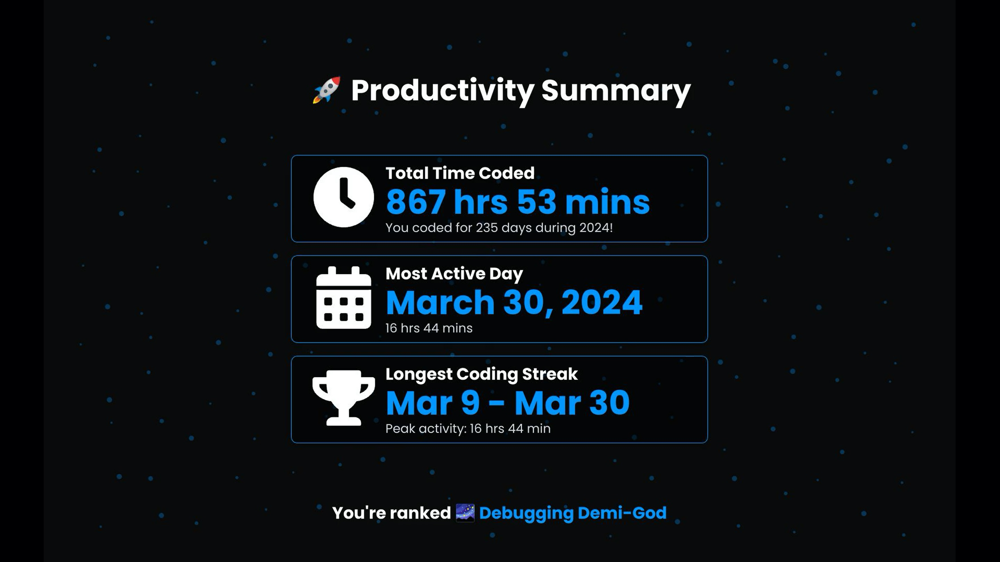

  
  <h1>WakaTime Wrapped</h1>

A stunning visualization of your wakatime yearly coding stats.

&nbsp;

&nbsp;

&nbsp;

&nbsp;

## 🚀 Overview
As a passionate WakaTime user, I wanted a fun way to relive my coding journey over the year—just like Spotify Wrapped does for music. That’s why I created WakaTime Wrapped, a platform to turn yearly coding stats into stunning animations, interactive displays, and shareable videos or cards.

## ✨ Features  
<table> <tr> <td> <strong>Yearly Coding Bests</strong>    Highlights your top coding moments, including best day, most productive week, and achievements. </td> <td> <strong>Productivity Insights</strong>    Provides a detailed breakdown of your productivity trends, such as coding activity across days and hours. </td> </tr> <tr> <td> <strong>Tools and OS Overview</strong>    Displays your most-used tools and operating systems throughout the year. </td> <td> <strong>Top Languages</strong>    Showcases your most-used programming languages and their respective contributions . </td> </tr> <tr> <td colspan="2"> <strong>Top Projects</strong>    Highlights your most time-intensive or impactful projects from the year. </td> </tr> </table>

## 🎯 Demo

### Video example
https://github.com/user-attachments/assets/1c19c722-be51-402f-b423-eb1ed0942f1f

### Card Examples

  
  

## 🛠️ Technologies Used  

### Frontend  
- **React + Vite**:  
  Built the user interface, and backend fetch logic. Used as container for the video player.  
- **[Remotion](https://github.com/remotion-dev/remotion)**:  
  THe library that made this possible : For programmatically build videos.

### Backend  
- **Python + Flask**:  
  Developed a lightweight and efficient backend API for processing and managing user data.  
- **Redis**:  
  Utilized for temporary data caching and speeding up backend operations.

### Cloud Services  
- **AWS Lambda**:  
  Serverless functions to handle video rendering tasks efficiently, cause Remotion doesn't supports client side rendering.  

## 📄 License
This project is licensed under the MIT License - see the [LICENSE](LICENSE) file for details.